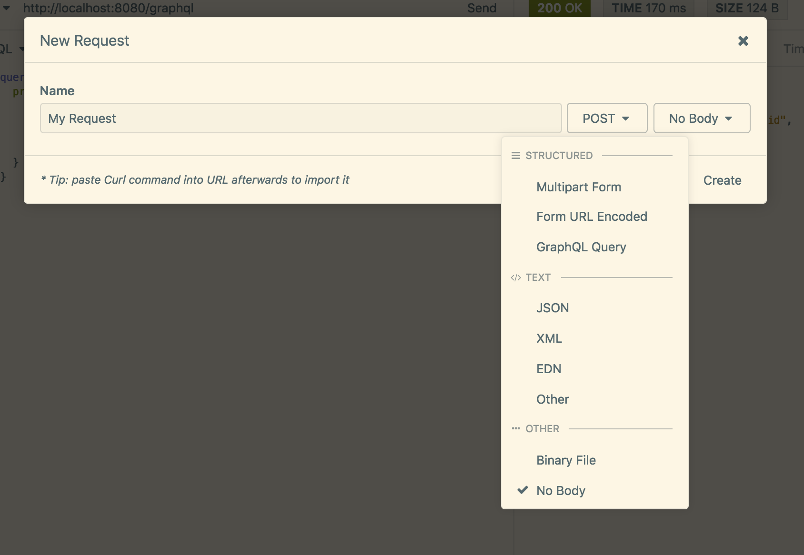
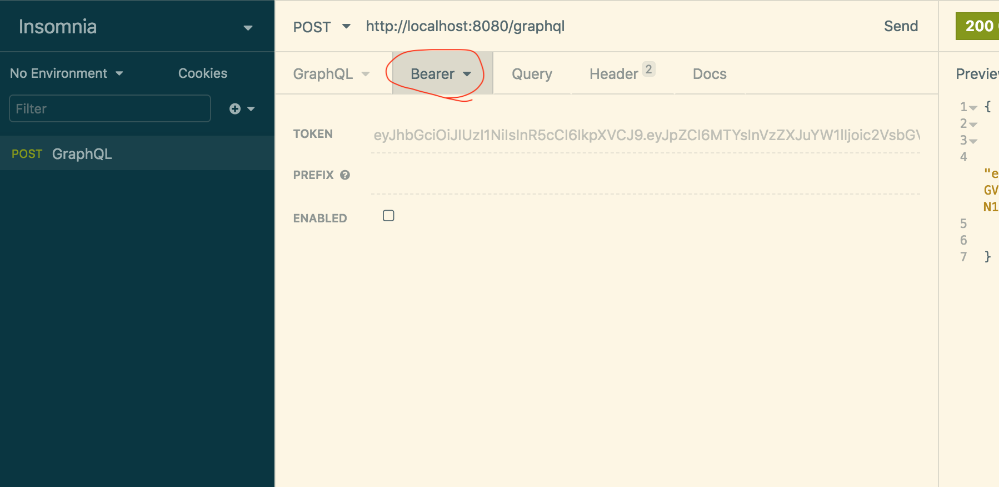

# Shopify Backend Challenge

## Overview
I completed this challenge using GraphQL implemented in Node.js to create the server API that connects to a psql database.

## Content
1. Database schema
2. Installation and startup
3. Basic requirement
4. Extra credit
5. Authentication(extra extra credit)

## 1. Database schema
The database tables and there corresponding columns are as follows-
1. carts - purpose is to demo the bonus requirement
    * id - primary key
    * cart_items - a dictionary with item name as keys and item count as values 
    * cart_subtotal - an int with the total dollar amount of all the items in cart

2. products - stores all products
    * id - primary key
    * title - string of product title
    * price - float of product price
    * inventory_count - int of product inventory

3. users - buyers or sellers
    * id - primary key
    * username - string of username
    * password_hash - string of hashed password
    * cart_items -  a dictionary with item name as keys and item count as values 
    * cart_subtotal - an int with the total dollar amount of all the items in cart
    * seller_status - boolean value checking whether user is buyer or seller

*Note - the carts table is so that you can just create a new cart, and add items, or checkout(fulfilling the bonus requirement). The cart in the users table is specific to just that user as I've added authentication, so you can sign in as a user, and add items to your own cart(just an extra functionility possible with the addition of authentication - extra bonus requirement).*

## 2. Package installation and Startup
1. `git clone https://github.com/istiaq107/shopify-backend-challenge`
2. `cd shopify-backend-challenge`
3. `chmod +x  mac_setup.sh` or `chmod +x ubuntu_setup.sh` (depending on what machine you're on)
4. `./mac_setup.sh` or `ubuntu_setup.sh` (ditto)
5. Visit the url http://localhost:8080/graphql

*Note - the bash script `*_setup.sh` just installs postgres, sets up the user, imports the sql dump into the database, installs npm packages, and starts it*

## 3. Basic Requirement

### __Fetching all or available products__
    
```
    query {
        products {
            id
            title
            price
            inventory_count
        }
    }

```
This query also takes an optional parameter of enum type `All` or `Available` where passing `All` returns all the products(which is the default), and passing `Available` only returns ones with available inventory.
```
    query {
        products(availability: Available) {
            id
            title
            price
            inventory_count
        }
    }
```

There are some products in the database already as I've input them in, but if you want to add more, jump to authentication, and you'll be able to add products, but the ones available should be enough for testing, so I recommend going in order.

### __Fetching one product__
Fetching one product would require knowing the id of said product whichi is obtained through the above `products` query. The corresponding query would be. Invalid id will show an error message.
```
    query {
        product(product_id:11) {
            id
            title
            price
            inventory_count
        }
    }
```

### __Purchasing a product__
Simple requires passing the id as parameter to the `purchase` query, and it returns that product info including the currrent `inventory_count`. Invalid id and 0 inventory products will show an error message.
```
    query {
        purchase(product_id:10) {
            id
            title
            price
            inventory_count
        }
    }
```

## 4. Extra Credit

### __Creating a cart__
A cart can be created using the mutation `createCart` which returns the id of the cart.
```
    mutation {
        createCart
    }
```

### __Adding items to cart__
This id can be passed as parameter along with the id of the desired product to the mutation `addToCart` to add items to the cart.
```
    mutation {
        addToCart(cart_id: 4, product_id:10) {
            items
            subtotal
        }
    }
```

This adds one product to the cart, and returns the items in the cart, and the subtotal of all the items.

### __Show cart(s)__
To see desired cart, call `cart` passing in the desired id which returns the card with it's items and subtotal, and if the id is invalid, it just returns null.
```
    query {
        cart(cart_id: 4) {
            items
            subtotal
    }
```
In case you forget the id if your cart, you can just view all available carts.
```
    query {
        carts {
            id
            items
            subtotal
        }
    }
```

### __Emptying cart__
The cart can also be emptied using the mutation `emptyCart` returning just a message.
```
    mutation {
        emptyCart(cart_id: 4)
    }
```

### __Cart checkout__
Use mutation `checkout` to complete the cart.
```
    mutation {
        checkout(cart_id:4) {
            items
            subtotal
        }
    }
```

This returns the cart again with the items purchased along with the subtotal. And calling this also empties the cart, and reduces the inventory of all the items that were in the cart by the amount they were purchased.

## 5. Authentication(extra extra credit)
For this you might want to use a client that allows you to make GraphQL api calls by passing in headers. I recommend using Insomnia. Follow the steps to set it up.
1. Download Insomnia https://insomnia.rest/download/
2. Open it, and click New Request. 
3. Use a nice name, and change the `GET` to `POST` which makes another dropdown appear beside.
4. Select GraphQL Query option. 
5. You're good to go.



### __Signin and Signup__

The query `signin` and mutatation `signup` can help you do that. Both the functions have required parameters `username` and `password`. The `username` has to be unique otherwise it sends an error message, and the password is hashed. `signup` also takes another optional parameter `seller_status` which by default is `false`, but if set to `true`, allows you to add to the product tables(`buyers` can do both buy and sell).

```
    mutation {
        signup(username:"user_1", password:"abc", seller_status:false)
    }

    query {
        signin(username:"user_1", password:"abc")
    }
```

These would return the access token. Now to actually sign in, you'll have to pass in the access token as header to the API call, to do this in Insomnia, click the tab Bearer just beside the GraphQL one you'll see at the top, and pass the access token in TOKEN(make sure ENABLED is checked). Please pass in the appropriate token otherwise it'll give out an error, and I didn't add any error handling for users(felt lazy).


 
You can see you're logged in using `me` query which will otherwise return `null`.

At this point, `addToCart`, `checkout`, `cart` and `emptyCart` are all going to modify your own cart, so the `cart_id` parameter won't be necessary anymore(please don't pass cart_id when you're logged in). Feel free to jump back to the extra credit section to test out these functions.

Now if you're a seller, you can also add or update products where all the parameters mentioned in the examples below are required.

```
    mutation {
        addProduct(title:"belt", price:45, count:5)
    }

    mutation {
        updateProduct(product_id: 15, title:"belt", price:45, count:0)
    }

```

Hope this completes the challenge.
